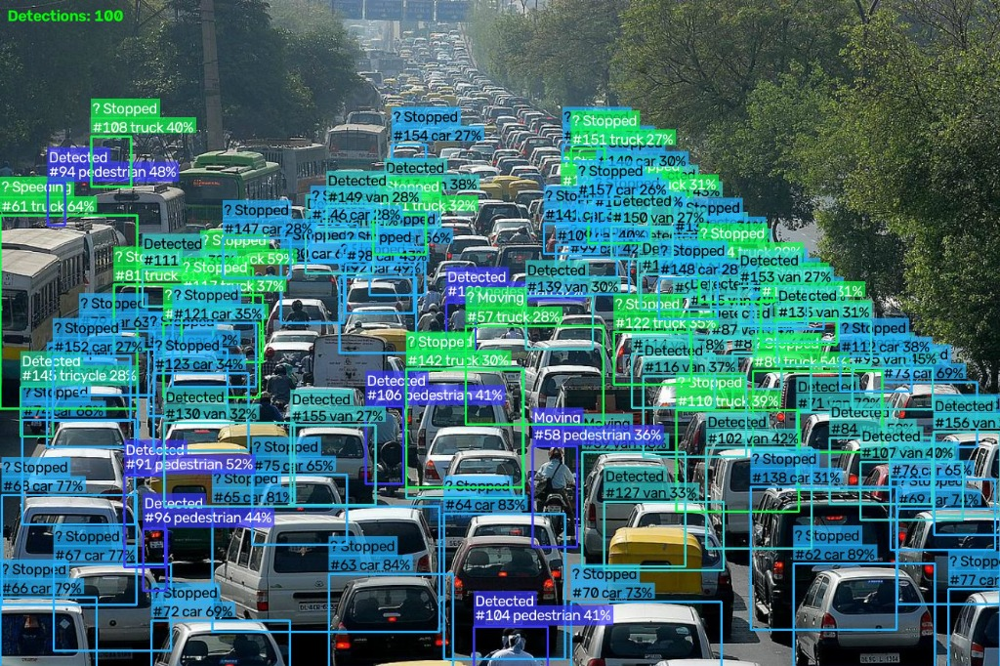
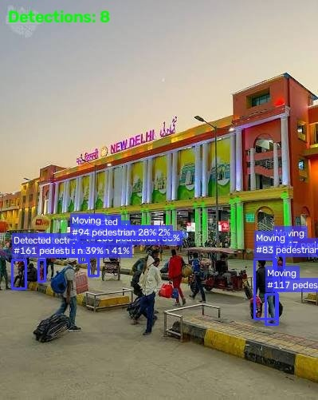
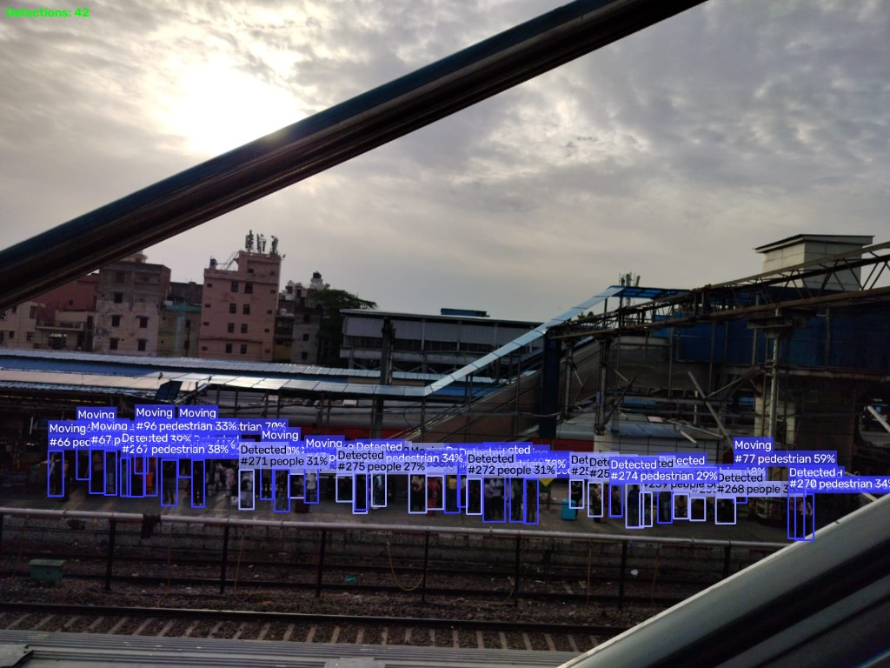

# 🎯 VisionAI — Real-Time Traffic Surveillance Platform

<div align="center">

[](https://python.org)
[](https://fastapi.tiangolo.com)
[](https://ultralytics.com)
[](https://react.dev)
[](https://docker.com)
[](tests/)
[](https://github.com/paulamartya25/web_monitoring-/actions/workflows/ci.yml)
[](experiments/ablation_results.csv)
[](LICENSE)

**A production-grade, full-stack real-time traffic surveillance platform** powered by a custom fine-tuned YOLOv8s model trained on VisDrone2019 — achieving **56% mAP@0.5** on aerial drone footage.

[Features](#-features) · [Demo](#-real-detection-results) · [Architecture](#-architecture) · [Quick Start](#-quick-start) · [API](#-api-reference) · [Model Performance](#-model-performance) · [Limitations](#-known-limitations)

</div>

---

## 📸 Real Detection Results

> All images below are **actual live outputs** from the running system — bounding boxes, persistent track IDs, confidence scores, and activity labels rendered in real time.

| Heavy Traffic — 100 Detections | New Delhi Station — 8 Detections | Station Aerial — 42 Detections |
|:---:|:---:|:---:|
|  |  |  |
| **100 objects** in dense Indian traffic — cars, trucks, vans, tricycles, pedestrians tracked simultaneously with persistent IDs | **8 pedestrians** at New Delhi Railway Station with track IDs #83–#161, confidence scores, Moving/Stopped labels | **42 pedestrians** from elevated viewpoint — matches VisDrone aerial training domain, crowd flow detected |

---

## ✨ Features

| Feature | Description |
|---|---|
| 🎥 **Live WebSocket Stream** | Real-time detection at 10–30 FPS via bidirectional WebSocket |
| 📁 **Image & Video Upload** | Detect in JPEG/PNG images and MP4/AVI/MOV videos |
| 🔭 **Multi-Object Tracking** | Persistent IDs across frames using centroid tracker + Hungarian algorithm |
| 🧠 **Activity Recognition** | Per-object behavior: Moving, Stopped, Speeding, Parked, Interacting |
| 📊 **Analytics Dashboard** | Detection history, class frequency charts, live confidence metrics |
| 🔒 **API Key Auth** | Optional middleware authentication for production deployment |
| 🌐 **Multi-Model Support** | Switch between YOLOv8n (640), YOLOv8n (1280), YOLOv8s VisDrone at runtime |
| 📥 **Annotated Download** | Download annotated images with bounding boxes directly from UI |
| 🐳 **Docker Ready** | Single `docker-compose up` to run full stack |
| ☁️ **Cloud Deployable** | Vercel (frontend) + Oracle Cloud Always Free (backend) |
| 🌓 **Dark / Light Theme** | Animated lamp toggle with warm amber light mode |
| 🎯 **AI Cursor Effect** | Nitro rainbow trail cursor with neural network background |

---

## 🏆 Model Performance

Fine-tuned YOLOv8s on **VisDrone2019-DET** — 38,759 annotated instances, 10 object classes, 81 epochs:

| Config | Model | Resolution | mAP@0.5 | Precision | Recall | Description |
|:---:|:---:|:---:|:---:|:---:|:---:|---|
| A1 | YOLOv8n | 640px | 0.69% | 7.89% | 1.47% | COCO pretrained baseline — no fine-tuning |
| A2 | YOLOv8n | 640px | 22.29% | 52.47% | 27.43% | Fine-tuned on VisDrone |
| A3 | YOLOv8n | 1280px | 37.25% | 57.69% | 44.74% | Fine-tuned + higher resolution |
| **A4** | **YOLOv8s** | **1280px** | **56.01%** | **64.10%** | **53.18%** | **Ours — best config** |

> **81× improvement** over the COCO pretrained baseline (0.69% → 56.01%). Full results: [`experiments/ablation_results.csv`](experiments/ablation_results.csv)

---

## 🏗️ Architecture

```
┌─────────────────────────────────────────────────────────────────┐
│                        FRONTEND (React 18 + Vite)               │
│  LiveStream  │  Upload  │  Evaluate  │  Dashboard (Analytics)   │
│  WebSocket Client │ Canvas API │ Axios │ Recharts                │
└──────────────────────────┬──────────────────────────────────────┘
                           │ HTTP REST + WebSocket
┌──────────────────────────▼──────────────────────────────────────┐
│                      BACKEND (FastAPI + Uvicorn)                 │
│                                                                  │
│   ┌──────────┐   ┌──────────┐   ┌──────────┐                   │
│   │ /detect  │   │ /ws/     │   │ /evaluate│                   │
│   │ (REST)   │   │ stream   │   │ (REST)   │                   │
│   └────┬─────┘   └────┬─────┘   └────┬─────┘                   │
│        │              │              │                           │
│   ┌────▼──────────────▼──────────────▼─────┐                   │
│   │            Core Pipeline                │                   │
│   │  YOLODetector → CentroidTracker         │                   │
│   │  → ActivityDescriptor → DrawingUtils    │                   │
│   └────────────────────┬────────────────────┘                   │
│                        │                                         │
│   ┌────────────────────▼────────────────────┐                   │
│   │   SQLite (aiosqlite + async SQLAlchemy)  │                   │
│   │   Detections table │ EvaluationRuns table│                   │
│   └─────────────────────────────────────────┘                   │
└─────────────────────────────────────────────────────────────────┘
```

---

## 🚀 Quick Start

### Option A — Docker (Recommended)

```bash
# 1. Clone the repo
git clone https://github.com/paulamartya25/web_monitoring-.git
cd web_monitoring-

# 2. Start everything
docker-compose up --build

# App:  http://localhost:3000
# API:  http://localhost:8000/docs
```

### Option B — Local Development (No Docker)

**Backend:**
```bash
cd backend
pip install -r requirements.txt
uvicorn main:app --reload --port 8000
```

**Frontend:**
```bash
cd frontend
npm install
npm run dev
# → http://localhost:3000
```

### Environment Variables

```bash
# backend/.env
API_KEY=           # Optional — leave empty to disable auth
MODEL_SIZE=yolov8n
CONFIDENCE_THRESHOLD=0.25
IOU_THRESHOLD=0.45
DATABASE_URL=sqlite+aiosqlite:///./detections.db
```

---

## 📋 Usage

### Live Webcam Detection
1. Open `http://localhost:3000/live`
2. Select model from dropdown (YOLOv8s VisDrone recommended for drone/aerial footage)
3. Click **Start Detection**
4. Grant camera permission → bounding boxes + track IDs appear in real time

### Upload Image / Video
1. Open `http://localhost:3000/upload`
2. Drag & drop any JPEG/PNG/MP4/AVI/MOV file
3. Adjust **Confidence Threshold** slider
4. Click **Detect Objects**
5. Download the annotated image directly from the result panel

### Analytics Dashboard
- Open `http://localhost:3000/dashboard`
- See **Attention** tab: critical alerts, high-confidence detections
- See **Figures** tab: bar chart (class frequency), line chart (detections over time)
- Export full detection log as CSV

---

## 🌐 API Reference

| Method | Endpoint | Description |
|:---:|---|---|
| `POST` | `/detect/image` | Upload image, returns base64 annotated image + detections JSON |
| `POST` | `/detect/video` | Upload video, returns processed video + per-frame detections |
| `GET` | `/detect/log` | Paginated detection history from database |
| `WS` | `/ws/stream` | WebSocket: send base64 JPEG frames, receive annotated frames |
| `POST` | `/evaluate/run` | Run mAP evaluation on a dataset |
| `GET` | `/evaluate/results` | List all evaluation runs |
| `GET` | `/evaluate/chart/{id}/{type}` | Get confusion matrix / ROC / PR curve chart |
| `GET` | `/health` | Health check + model info |
| `POST` | `/model/reload` | Hot-swap model at runtime without restart |

Full interactive docs: **`http://localhost:8000/docs`**

---

## 📁 Project Structure

```
web_monitoring-/
├── backend/
│   ├── main.py                  # FastAPI app + middleware + lifespan
│   ├── core/
│   │   ├── detector.py          # YOLOv8 inference wrapper
│   │   ├── tracker.py           # CentroidTracker + Hungarian algorithm
│   │   ├── traffic_analyzer.py  # Rule-based activity descriptor
│   │   ├── zone_config.py       # VehicleCounter + zone monitoring
│   │   └── config.py            # Pydantic settings from .env
│   ├── routers/
│   │   ├── detect.py            # Image + video REST endpoints
│   │   ├── stream.py            # WebSocket streaming endpoint
│   │   └── evaluate.py          # Dataset evaluation endpoints
│   ├── db/
│   │   ├── database.py          # Async SQLAlchemy engine + session
│   │   └── models.py            # Detection + EvaluationRun ORM models
│   ├── utils/
│   │   ├── drawing.py           # Bounding box + label rendering
│   │   └── video.py             # Video processing pipeline
│   ├── models/                  # YOLOv8 .pt model files
│   ├── requirements.txt
│   └── requirements-test.txt    # Lightweight CI test dependencies
│
├── frontend/
│   └── src/
│       ├── pages/
│       │   ├── LiveStream.jsx   # WebSocket stream + canvas rendering
│       │   ├── Upload.jsx       # File upload + annotated result display
│       │   ├── Evaluate.jsx     # Dataset evaluation trigger + charts
│       │   └── Dashboard.jsx    # Analytics dashboard (Facto-style)
│       ├── components/
│       │   ├── Navbar.jsx       # Glassmorphism navbar
│       │   ├── AICursor.jsx     # Nitro rainbow cursor
│       │   ├── NeuralBackground.jsx  # Canvas particle network
│       │   ├── LampToggle.jsx   # Animated dark/light toggle
│       │   └── ModelSelector.jsx
│       └── context/
│           └── ThemeContext.jsx # Dark/light theme provider
│
├── tests/                       # 51 unit tests (pytest)
├── experiments/
│   └── ablation_results.csv     # 4-config ablation study results
├── docs/
│   └── demo/                    # Real detection output images
├── .github/
│   └── workflows/ci.yml         # GitHub Actions CI pipeline
└── docker-compose.yml
```

---

## 🧪 Tests

```bash
# Run all 51 tests
cd backend
pytest tests/ -v --tb=short

# Output:
# 51 passed in ~3.2s
```

CI runs automatically on every push to `master` via GitHub Actions.

---

## ⚠️ Known Limitations

Being honest about what this system does and does not do:

| Limitation | Detail |
|---|---|
| **Domain mismatch** | VisDrone models trained on aerial drone footage — accuracy degrades on ground-level webcam streams. Use COCO models (`yolov8n`) for ground-level cameras. |
| **Speed not calibrated** | `~X km/h` is relative pixel displacement × empirical factor — **not** true speed. Accurate speed requires camera intrinsics + homography calibration. |
| **Activity labels are rule-based** | "Moving/Stopped/Speeding" derived from pixel displacement thresholds, not pose estimation or learned action recognition. |
| **SQLite** | Not suitable for high-concurrency production workloads. PostgreSQL + Redis recommended for multi-user deployment. |
| **No GPU on free cloud** | Oracle Cloud free tier is CPU-only → ~1–3 FPS inference (vs 15+ FPS on GPU). |
| **mAP ceiling at 56%** | VisDrone state-of-the-art is ~70%+ using SAHI tiling + transformer backbones. Our 56% is a solid baseline, not SOTA. |

---

## 🛠️ Tech Stack

| Layer | Technology |
|---|---|
| **Object Detection** | YOLOv8s (Ultralytics) — fine-tuned on VisDrone2019 |
| **Tracking** | Custom CentroidTracker + Hungarian algorithm (scipy) |
| **Backend** | FastAPI, Uvicorn, asyncio, Pydantic, Python 3.11 |
| **WebSocket** | FastAPI WebSocket + base64 JPEG frame streaming |
| **Database** | SQLite + async SQLAlchemy + aiosqlite |
| **Frontend** | React 18, Vite, Tailwind CSS |
| **Charts** | Recharts (Bar, Line, Pie) |
| **Canvas** | HTML5 Canvas API for real-time frame rendering |
| **Containerization** | Docker, Docker Compose |
| **CI/CD** | GitHub Actions (ubuntu-latest, Python 3.11) |
| **Testing** | pytest, 51 unit tests |

---

## ☁️ Cloud Deployment

| Service | Platform | Cost |
|---|---|---|
| Frontend | Vercel | Free |
| Backend | Oracle Cloud Always Free (ARM VM, 4 vCPU, 24GB) | Free |

See [`Cloud_Deployment_Guide.md`](docs/Cloud_Deployment_Guide.md) for full step-by-step instructions.

---

## 📄 License

MIT © 2026 Amartya Paul — [`paulamartya25`](https://github.com/paulamartya25)
